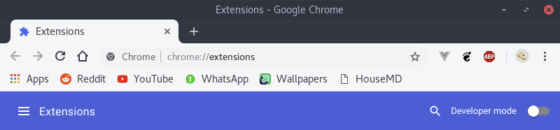
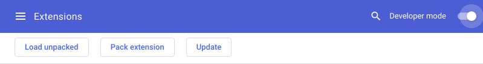
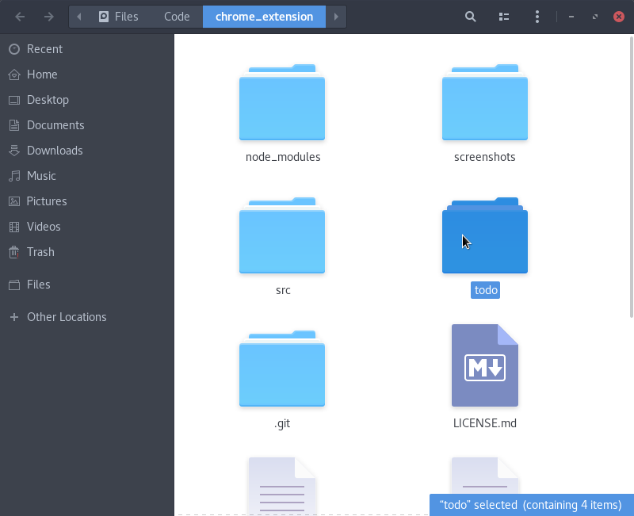
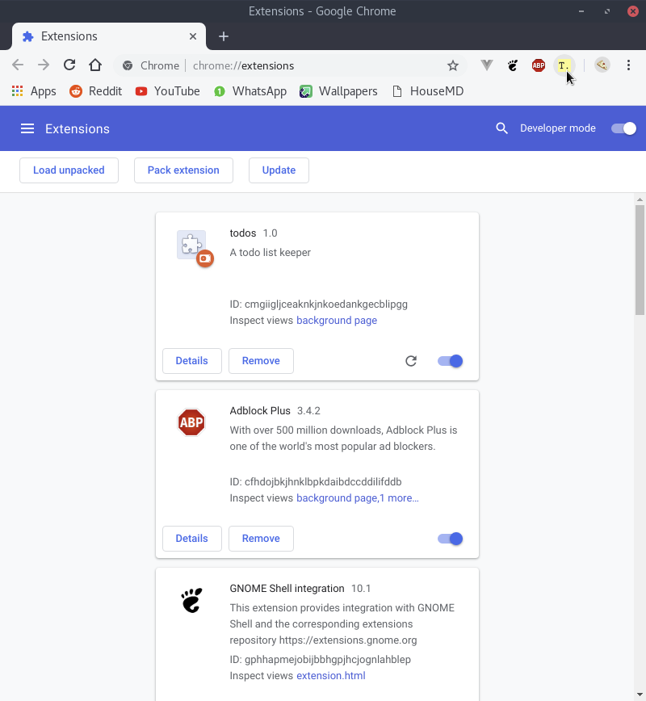
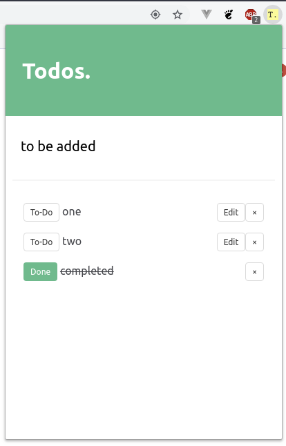

# todos. chrome extension
A chrome extension built with VueJS. 

## Getting Started

These instructions will get you a copy of the project up and running on your local machine for development and testing purposes.

Clone the repository into your local machine and install the dependencies with
```
npm install
```
Changes made to the files in the src directory needs to be transpiled down to the app. To do this, run
```
npm run dev
```
To automatically track changes to the files and transpile them as soon as any changes are made, we run a persistent file watcher in the background with this command
```
npm run watch
```

##Loading the extension

* Open google chrome and go to `chrome://extensions/` or open the Extension manager from settings.
* Enable developer mode to load extensions from filesystem.

* Click on **Load unpacked extension**


* Select the todo folder cloned from the repository

* The extension will be added to chrome and an icon will appear on the chrome menu


---



**Note:** The primary color of the extension can be changed by changing the value of the ` $primary ` variable in `src/app.scss` and recompiling by running either the `watch` or `dev` npm script.
	


## Built With

* [VueJS](https://vuejs.org/) - The frontend framework
* [Bulma](https://bulma.io/) - CSS framework based on flexbox
* [webpack](https://webpack.js.org/) - Bundles all the scripts into one single file 
* [laravel-mix](https://laravel-mix.com/) - a wrapper around webpack that simplifies the build process

## License

This project is licensed under the MIT License - see the [LICENSE.md](LICENSE.md) file for details
